<!-- =======================
     DIRECTORA • README
     Elite / Enterprise-grade
     ======================= -->

<p align="center">
  
</p>

<p align="center">
  <a href="https://github.com/Scrutexity/Directora/actions/workflows/governance-proof.yml">
    
  </a>
  
  
  
  
  
</p>

<h1 align="center">Directora</h1>

<p align="center">
  <strong>The governed infrastructure backbone behind Scrutexity outcomes.</strong><br/>
  <em>Immutable ledger • Atomic sign-off • Zero-drift contracts</em>
</p>

<p align="center">
  <a href="#why-directora">Why</a> ·
  <a href="#core-guarantees">Guarantees</a> ·
  <a href="#architecture">Architecture</a> ·
  <a href="#quick-start">Quick Start</a> ·
  <a href="#brief-api">Brief API</a> ·
  <a href="#governance-proof">Governance Proof</a> ·
  <a href="#security--compliance-notes">Security</a>
</p>

<div align="center">
  <strong>Engine published as proof of governance.</strong>
  <br/>
  <code>labbrief_kit/</code> is the public integration surface.
</div>

<br/>

<p align="center">
  
</p>

---

## Why Directora

Modern clinical operations don’t fail because teams don’t care — they fail because **systems drift**:
- “Signed” actions don’t map to immutable state.
- Retries create duplicates or partial commits.
- Clients and servers evolve independently until contracts break.

Directora exists to make the critical moment (sign-off) **provable**.

> **Directora is an immutable, governed commit system for sign-offs.**  
> If it passes governance, client + server cannot drift.

---

## ✨ Core Guarantees

| Guarantee | What it means in practice | What you get |
|---|---|---|
| **Atomicity** | Ledger append is the commit point | No partial states |
| **Idempotency** | Byte-identical replay with replay detection | Safe retries |
| **Contract Integrity** | Signed golden contract prevents drift | Stable integrations |
| **Auditability** | Immutable history with PHI-minimizing references | Owner-safe traceability |

> **Important:** Not a clinical, legal, or regulatory assessment. Only `patient_ref` / `encounter_ref` are stored.

---

## Architecture

```mermaid
flowchart TD
  A[LabBrief UI] -->|POST /api/brief/sign\nIdempotency-Key + Signature| B[Directora - FastAPI]
  B --> C[Signature Validation]
  C --> D[Atomic Ledger Append]
  D --> E[Event Binding Hash]
  E --> F[200 OK + ledger_event_id]
  F --> G[LabBrief Kit - TypeScript]
  G --> H[Retry Policy + Drift Detection]
  style B fill:#0A2540,stroke:#00C853,stroke-width:2px
```



### Repository Map

```text
directora/                 # FastAPI server (append-only ledger + signing)
labbrief_kit/              # TypeScript integration surface (client SDK)
shared/                    # Golden contract & schemas
tests/governance/          # Drift gates + proof checks (CI)
DEPLOYMENT.md              # Deploy guidance
HANDOFF.md                 # Integration handoff notes
```

---

## 📦 What This Repository Contains

| Component | Tech | Purpose |
|---|---|---|
| **Directora** | FastAPI + Python | Governed server: append-only ledger, atomic commits, idempotency |
| **LabBrief Kit** | TypeScript | Integration surface: schemas, retries, drift detection |
| **Shared Contract** | JSON Schema | Single source of truth: `shared/brief-api-contract.json` |

---

## 🚀 Quick Start

### Local Development

```bash
# 1) Environment
python -m venv .venv
source .venv/bin/activate
pip install -r requirements.txt

# 2) Run
uvicorn directora.api.server:app --host 0.0.0.0 --port 8000 --reload
```

### Health Check

```bash
curl http://localhost:8000/health
```

---

## 🔌 Brief API

### Key Endpoints

- `GET  /api/brief/pending`
- `GET  /api/brief/provider`
- `POST /api/brief/sign`
- `GET  /api/labs/audit`

### Signing Contract (At a glance)

| Header / Field | Required | Why it exists |
|---|---:|---|
| `Idempotency-Key` | ✅ | Safe retries for clients (no double-commits) |
| `Signature` | ✅ | Prevent tampering; verify sign-off authenticity |
| `X-Contract-Version` | ✅ | Drift detection against the golden contract |
| `X-Idempotency-Replayed` | server | Indicates replayed request returned identical response |

---

## ✅ Governance Proof

Directora is designed to be *provably governed*.

### The Gate

```bash
./tests/governance/ultimate-governance-check.sh
```

Expected:

```text
✅ GOVERNANCE ARCHITECTURE INTACT
   Directora and LabBrief cannot drift.
```

### What governance enforces

- **Golden contract stays canonical** (`shared/brief-api-contract.json`)
- **Client SDK and server must match** (versioned, tested)
- **Breaking drift fails CI** (cannot merge “quiet breaks”)

---

## Enterprise Signals

### Zero-Drift Contracts

Directora treats the shared contract as a **golden artifact**.  
Changes must be deliberate, versioned, and validated.

### Audit Trail Without PHI Bloat

Events bind to references (`patient_ref`, `encounter_ref`) and keep sensitive payloads out of the ledger.

### Retry-Safe by Design

Retries are first-class: idempotency guarantees **exact same response** on replay.

---

## 📁 Where to Look

- **Governance Proof** → `tests/governance/ultimate-governance-check.sh`
- **Integration Kit** → `labbrief_kit/`
- **Golden Contract** → `shared/brief-api-contract.json`
- **Deployment** → `DEPLOYMENT.md`
- **Handoff** → `HANDOFF.md`

---

## Security & Compliance Notes

- **PHI-minimizing references** only; avoid storing raw clinical content in the ledger.
- **Not a compliance certification** (HIPAA / SOC2 / etc.). This repo provides governance mechanisms and auditability patterns.
- Prefer **least-privilege** runtime credentials and scoped secrets for CI.

---

## Roadmap (High leverage)

- [ ] Contract version negotiation strategy (strict vs compatible)
- [ ] Ledger compaction strategy (read models / snapshots)
- [ ] Formal verification harness for replay invariants
- [ ] Typed client generation from contract (automated)

---

<p align="center">
  
</p>

<p align="center">
  <strong>Built with precision. Governed by proof.</strong><br/>
  <em>Directora — Internal Scrutexity Infrastructure</em>
</p>
