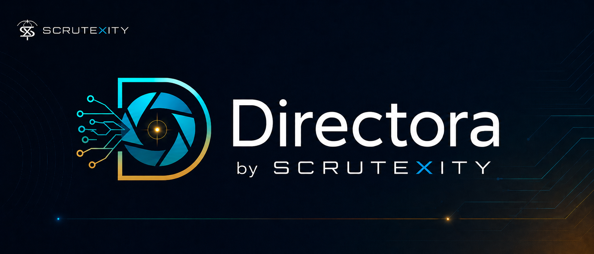

<div align="center">
  
  <br/><br/>

  <a href="https://github.com/Scrutexity/Directora/actions/workflows/governance-proof.yml">
<<<<<<< HEAD
    
=======
    
>>>>>>> 85e7571 (docs: Clean README with proof-verified branding, no double-badging)
  </a>
  
  
  

  <br/><br/>
  <b>Directora is internal Scrutexity infrastructure—the machine behind our outcomes.</b><br/>
<<<<<<< HEAD
  Engine published as proof of governance. <code>labbrief_kit/</code> is the integration surface. Full LabBrief UI remains private.
  <br/><br/>
  <i>Not a clinical, legal, or regulatory assessment. PHI-minimizing IDs only (<code>patient_ref</code>, <code>encounter_ref</code>).</i>
=======
  Engine published as proof of governance. LabBrief kit available for integration. Full LabBrief app remains private.
  <br/><br/>
  <i>Not a clinical, legal, or regulatory assessment. PHI-minimizing IDs only.</i>
>>>>>>> 85e7571 (docs: Clean README with proof-verified branding, no double-badging)
</div>

---

> 🔒 **Governed. Proof-verified. MIT-Licensed.**  
> This repo ships a 60-second governance proof script + CI gate.
<<<<<<< HEAD
=======

## Verify in 60 seconds

\`\`\`bash
./tests/governance/directora-governance-check.sh
\`\`\`

Expected output: ✅ ALL DIRECTORA GOVERNANCE CHECKS PASSED

---

## The Problem We Solve
>>>>>>> 85e7571 (docs: Clean README with proof-verified branding, no double-badging)

## What this repo contains

- **Directora (FastAPI · Python)** — governed server: append-only ledger, atomic sign-off, idempotency replay, contract snapshot drift guard.
- **LabBrief kit (TypeScript)** — integration kit: schemas + retry policy + idempotency lifecycle + drift detector (kit-only; not the full UI).
- **Shared wire contract** — `shared/brief-api-contract.json` is the single contract source of truth.

---

## Data Flow

```
┌──────────────┐
│   LabBrief   │
│  (Client UI) │
└────────┬─────┘
         │
         │ POST /api/brief/sign
         │ (idempotency key + signature)
         │
         ▼
┌──────────────────────────┐
│  Directora (FastAPI)     │
│  ─────────────────────   │
│  • Validate signature    │
│  • Atomic ledger append  │
│  • X-Idempotency headers │
└────────┬────────────────┘
         │
         │ 200 OK (ledger_event_id, binding_hash)
         │ X-Contract-Version
         │ X-Idempotency-Replayed
         │ X-Request-ID
         │
         ▼
┌─────────────────────────────────────┐
│   LabBrief Kit (TypeScript)         │
│   ─────────────────────────────────  │
│   • Retry on 503 / 429 / timeout    │
│   • Never retry on 409 / 422 / 4xx  │
│   • Contract drift detection        │
│   • Audit trail consumption         │
└─────────────────────────────────────┘
```

---

## Verify in 60 seconds (the gate)

Run from repo root:

```bash
./tests/governance/ultimate-governance-check.sh
```

Expected output:

```
✅ GOVERNANCE ARCHITECTURE INTACT
   Directora and LabBrief cannot drift.
   Atomicity, idempotency, and contract versioning all verified.
```

CI runs the same proof on every PR via `.github/workflows/governance-proof.yml`.

---

## Brief API

### Endpoints

```
GET  /api/brief/pending
GET  /api/brief/provider
POST /api/brief/sign
GET  /api/labs/audit
```

### Signing Guarantees

- **Atomicity** — ledger append is the commit point; no partial state on failure.
- **Idempotency** — byte-identical replay for the same `Idempotency-Key` (replay header surfaced).
- **Hash-binding** — signature binds to canonical Provider Brief JSON (stable artifact).

---

## Quick start (local)

### Install

```bash
python -m venv .venv
source .venv/bin/activate
pip install -r requirements.txt
```

### Run

```bash
uvicorn directora.api.server:app --host 0.0.0.0 --port 8000
```

### Health

```bash
curl http://localhost:8000/health
```

---

## Where to look

| For | Open |
|---|---|
| Ship doc (repo-native) | `RELEASE.md` |
| Polished ship doc (HTML) | `docs/release/release-page.html` |
| Governance proof (the gate) | `tests/governance/ultimate-governance-check.sh` |
| Contract snapshot | `shared/brief-api-contract.json` |
| Release history | `CHANGELOG.md` |
| Ops handoff | `HANDOFF.md` |
| Deployment runbook | `DEPLOYMENT.md` |
| LabBrief integration kit | `labbrief_kit/` |

---

<details>
<summary><b>Advanced: Idempotency & Atomicity</b></summary>

<<<<<<< HEAD
### Idempotency Lifecycle

Every sign request carries an `Idempotency-Key` header. The server stores the request + response for 24 hours:

- **First attempt** → computes signature, appends ledger entry, returns 200 + ledger_event_id.
- **Retry with same key** → lookup finds the original response, returns it byte-identical + `X-Idempotency-Replayed: true`.
- **Retry with same key, different body** → mismatch detected → `409 idempotency_conflict`.

### Atomicity Guarantee

The ledger append is the commit point. If finalization (e.g., updating the audit trail) fails after the append succeeds:
- Brief stays in `pending_review`.
- Zero rollback events are written.
- Client retries with the same key and gets the original ledger_event_id back.

### Contract Versioning

Every response carries `X-Contract-Version` matching `shared/brief-api-contract.json::version`. The LabBrief kit validates this on every call and surfaces drift as a dev-only banner.

### Backpressure & Retry

```
503 idempotency_store_busy  → retry with Retry-After + same key
429 too_many_requests       → retry with Retry-After + same key
network timeout             → retry with exponential backoff + same key
409 already_signed          → do NOT retry (show audit trail)
422 invalid_signature       → do NOT retry (re-open signing UI)
```

</details>
=======
| Release | Highlights |
|---------|-----------|
| **v3.7.1** | MIT License · Proof-verified governance · Production hardening |
| **v3.7** | Prometheus metrics · JWKS auth · Load tests |
| **v3.6** | SQLite multi-worker · Idempotency · JWT auth |

See [CHANGELOG.md](./CHANGELOG.md) for canonical release notes.
>>>>>>> 85e7571 (docs: Clean README with proof-verified branding, no double-badging)

---

## Posture

<<<<<<< HEAD
- Governed workflows with human sign-off.
- Append-only audit trail.
- PHI-minimizing identifiers.
- Not a clinical, legal, or regulatory assessment.
=======
### 🔷 Schemas & Validation
| Module | Purpose |
|--------|---------|
| \`scrutexity/schema.py\` | Receipt schema + validation |
| \`scrutexity/authority_brief.py\` | Receipt → Authority Brief |
| \`api/contract.py\` | Generates brief-api-contract.json |

### 🔷 Authority & Review
| Module | Purpose |
|--------|---------|
| \`scrutexity/personas.py\` | 6 Authority reviewer roles |
| \`mirror/transcript.py\` | Authority Review Summary |
| \`scrutexity/language.py\` | Safe language rules |
| \`nodes/authority_brief_node.py\` | LangGraph node |

### 🔷 API & Integration
| Module | Purpose |
|--------|---------|
| \`api/server.py\` | FastAPI app |
| \`api/routes/brief.py\` | GET /pending, POST /sign, GET /provider |
| \`api/routes/audit.py\` | GET /labs/audit |
| \`api/health.py\` | /health endpoint |

---

## Configuration

### Development
\`\`\`bash
ENV=development
AUTH_MODE=stub
BRIEF_STORE_BACKEND=sqlite
\`\`\`

### Production
\`\`\`bash
ENV=production
AUTH_MODE=jwks
JWKS_URL=https://your-auth-provider/.well-known/jwks.json
BRIEF_STORE_BACKEND=sqlite
CORS_ALLOW_ORIGINS=https://yourlabbrief.com
\`\`\`

---

## Testing

### Unit Tests
\`\`\`bash
pytest tests/
\`\`\`

### Load Testing
\`\`\`bash
locust -f tests/load/sign_off_load_test.py -H http://localhost:8000
\`\`\`

### Governance Validation
\`\`\`bash
bash tests/governance/directora-governance-check.sh
\`\`\`

---

## Integration: LabBrief Kit

\`labbrief_kit/\` provides:
- **briefClient.ts** — Fetch-based adapter with idempotency keys
- **schemas/contract.ts** — Zod schemas mirroring API contract
- **api/errorMessages.ts** — Error-code → UI copy mapping
>>>>>>> 85e7571 (docs: Clean README with proof-verified branding, no double-badging)

---

## About Scrutexity

<<<<<<< HEAD
Scrutexity helps premium clinics recover missed demand and build AI authority. Directora is our internal engine—Scrutexity sells outcomes, not the machine itself.
=======
**Scrutexity** builds AI authority for medical clinics. We help premium aesthetics, wellness, longevity, peptide/HRT, injectables, men's performance, and med spa clinics reduce booking friction through governed, claim-safe content visibility.

Directora is our **internal engine**—we sell Scrutexity outcomes, not the machine itself.

> Recover missed demand. Build AI authority.

---

<div align="center">

**Built for governed clinic authority.**

**Engine proof-verified and published.**

**Directora by Scrutexity**

</div>
>>>>>>> 85e7571 (docs: Clean README with proof-verified branding, no double-badging)
