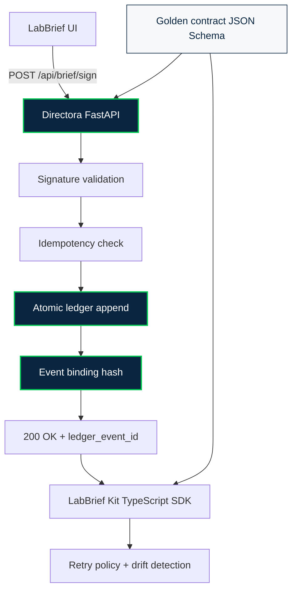

<!-- =======================
     DIRECTORA • README
     Enterprise-grade governance proof
     ======================= -->

<p align="center">
  
</p>

<p align="center">
  <a href="https://github.com/Scrutexity/Directora/actions/workflows/governance-proof.yml">
    
  </a>
  <a href="https://github.com/Scrutexity/Directora/stargazers">
    
  </a>
  <a href="https://github.com/Scrutexity/Directora/releases">
    
  </a>
  <a href="https://github.com/Scrutexity/Directora/blob/main/LICENSE">
    
  </a>
  
  
  
  
</p>

<p align="center">
  
</p>

<h1 align="center">Directora</h1>

<p align="center">
  <strong>The governed infrastructure backbone behind Scrutexity outcomes.</strong><br/>
  <em>Immutable ledger • Atomic sign-off • Zero-drift contracts</em>
</p>

<p align="center">
  <a href="#why-directora">Why</a> ·
  <a href="#core-guarantees">Guarantees</a> ·
  <a href="#architecture">Architecture</a> ·
  <a href="#quick-start">Quick Start</a> ·
  <a href="#brief-api">Brief API</a> ·
  <a href="#governance-proof">Governance Proof</a> ·
  <a href="#enterprise-signals">Enterprise Signals</a> ·
  <a href="#security--compliance-notes">Security</a>
</p>

<div align="center">
  <strong>Engine published as proof of governance.</strong>
  <br/>
  <code>labbrief_kit/</code> is the public integration surface.
</div>

---

## Why Directora

Modern clinical operations do not fail because teams lack intent. They fail because **systems drift**:

- “Signed” actions do not map to immutable state.
- Retries create duplicates or partial commits.
- Clients and servers evolve independently until contracts break.
- Audit trails become after-the-fact narratives instead of provable commit history.

Directora exists to make the critical moment — sign-off — **provable**.

> **Directora is an immutable, governed commit system for sign-offs.**  
> If it passes governance, client and server cannot drift.

---

## Core Guarantees

| Guarantee | What it means in practice | What you get |
|---|---|---|
| **Atomicity** | Ledger append is the commit point | No partial states |
| **Idempotency** | Byte-identical replay with replay detection | Safe retries |
| **Contract Integrity** | Signed golden contract prevents drift | Stable integrations |
| **Auditability** | Immutable history with PHI-minimizing references | Owner-safe traceability |
| **Governed Failure** | Invalid signatures, drift, and replay conflicts fail closed | Safer clinical-adjacent workflows |

> **Important:** This repository is not a clinical, legal, HIPAA, SOC 2, or regulatory certification. It demonstrates governance mechanisms and auditability patterns. Only `patient_ref` / `encounter_ref` style references should be stored in the ledger.

---

## Architecture

The diagram below intentionally uses plain Mermaid syntax to avoid rendering artifacts.



### Repository Map

```text
directora/                 # FastAPI server: append-only ledger, signing, governance gates
labbrief_kit/              # TypeScript integration surface: schemas, retries, drift detection
shared/                    # Golden contract and schemas
tests/governance/          # Drift gates and proof checks for CI
docs/                      # Architecture notes and diagrams
DEPLOYMENT.md              # Deploy guidance
HANDOFF.md                 # Integration handoff notes
CONTRIBUTING.md            # Contribution rules
SECURITY.md                # Security and healthcare-adjacent reporting policy
```

For the deeper system diagram, see [`docs/ARCHITECTURE.md`](docs/ARCHITECTURE.md).

---

## What This Repository Contains

| Component | Tech | Purpose |
|---|---|---|
| **Directora** | FastAPI + Python | Governed server: append-only ledger, atomic commits, idempotency |
| **LabBrief Kit** | TypeScript | Integration surface: schemas, retries, drift detection |
| **Shared Contract** | JSON Schema | Single source of truth: `shared/brief-api-contract.json` |
| **Governance Tests** | Bash + Python test suite | Proof gates for contract drift, replay safety, and ledger invariants |

---

## Quick Start

### Local Development

```bash
# 1) Environment
python -m venv .venv
source .venv/bin/activate
pip install -r requirements.txt

# 2) Run
uvicorn directora.api.server:app --host 0.0.0.0 --port 8000 --reload
```

### Health Check

```bash
curl http://localhost:8000/health
```

### Governance Check

```bash
./tests/governance/ultimate-governance-check.sh
```

Expected:

```text
✅ GOVERNANCE ARCHITECTURE INTACT
   Directora and LabBrief cannot drift.
```

---

## Brief API

### Key Endpoints

- `GET  /api/brief/pending`
- `GET  /api/brief/provider`
- `POST /api/brief/sign`
- `GET  /api/labs/audit`

### Signing Contract

| Header / Field | Required | Why it exists |
|---|---:|---|
| `Idempotency-Key` | Yes | Safe retries for clients without double commits |
| `Signature` | Yes | Tamper resistance and sign-off authenticity |
| `X-Contract-Version` | Yes | Drift detection against the golden contract |
| `X-Idempotency-Replayed` | Server | Indicates a replay returned the identical response |

### Minimal Signing Flow

```text
Client prepares sign-off payload
  ↓
Client sends Idempotency-Key + Signature + Contract Version
  ↓
Directora validates signature and contract
  ↓
Directora appends the event atomically
  ↓
Directora returns ledger_event_id
  ↓
Replay with same key returns the same response
```

---

## Governance Proof

Directora is designed to be **provably governed**, not merely well organized.

### What governance enforces

- **Golden contract stays canonical**: `shared/brief-api-contract.json`
- **Client SDK and server must match**: versioned, tested, and drift-checked
- **Breaking drift fails CI**: quiet contract breaks should not merge
- **Replay behavior is stable**: idempotency protects against duplicate commits
- **Ledger writes are append-only**: sign-off history remains traceable

### Proof surface

```bash
./tests/governance/ultimate-governance-check.sh
```

This is the repo’s main enterprise signal: a single governance gate that proves Directora and LabBrief cannot drift silently.

---

## Enterprise Signals

### Zero-Drift Contracts

Directora treats the shared contract as a **golden artifact**. Changes must be deliberate, versioned, and validated.

### Audit Trail Without PHI Bloat

Events bind to references such as `patient_ref` and `encounter_ref`. Sensitive clinical content should stay outside the ledger unless an explicitly audited storage path is created.

### Retry-Safe by Design

Retries are first-class. Idempotency guarantees the **exact same response** on byte-identical replay.

### Used Internally at Scrutexity

Directora is used internally as Scrutexity’s governance proof layer for clinical-adjacent workflow design, sign-off infrastructure, and zero-drift contract enforcement.

---

## Star History

<a href="https://star-history.com/#Scrutexity/Directora&Date">
  
</a>

---

## Where to Look

| Need | File |
|---|---|
| Governance proof | `tests/governance/ultimate-governance-check.sh` |
| Integration kit | `labbrief_kit/` |
| Golden contract | `shared/brief-api-contract.json` |
| Architecture notes | `docs/ARCHITECTURE.md` |
| Mermaid source | `docs/directora-architecture.mmd` |
| Deployment | `DEPLOYMENT.md` |
| Handoff | `HANDOFF.md` |
| Security policy | `SECURITY.md` |
| Contribution rules | `CONTRIBUTING.md` |

---

## Security & Compliance Notes

- Use **PHI-minimizing references** only unless a separately audited storage path exists.
- Do not commit secrets, tokens, patient data, raw clinical notes, or production identifiers.
- This repo is **not** a compliance certification for HIPAA, SOC 2, HITRUST, FDA, or any regulatory framework.
- Prefer least-privilege runtime credentials and scoped CI secrets.
- Report suspected vulnerabilities through the process in [`SECURITY.md`](SECURITY.md).

---

## Roadmap

- [ ] Contract version negotiation strategy: strict vs compatible
- [ ] Ledger compaction strategy: read models and snapshots
- [ ] Formal verification harness for replay invariants
- [ ] Typed client generation from the golden contract
- [ ] Expanded architecture diagrams in `docs/`
- [ ] Demo walkthrough video replacing the placeholder animated GIF

---

<p align="center">
  <strong>Built with precision. Governed by proof.</strong><br/>
  <em>Directora — Internal Scrutexity Infrastructure</em>
</p>
