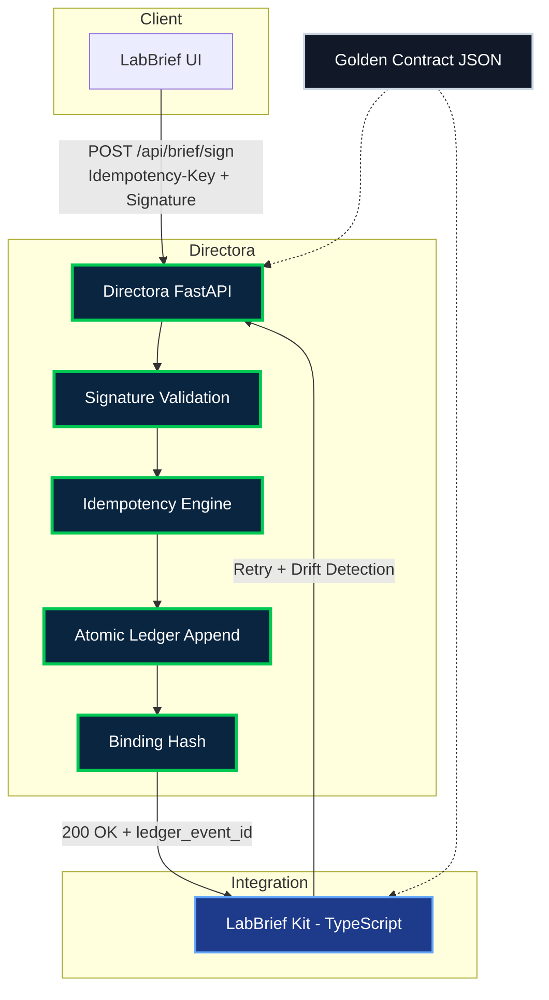

<!-- =======================
     DIRECTORA • README
     Master-Class Governance Infrastructure
     ======================= -->

<p align="center">
  
</p>

<p align="center">
  <a href="https://github.com/Scrutexity/Directora/actions/workflows/governance-proof.yml">
    
  </a>
  <a href="https://github.com/Scrutexity/Directora/stargazers">
    
  </a>
  <a href="https://github.com/Scrutexity/Directora/releases">
    
  </a>
  <a href="https://github.com/Scrutexity/Directora/blob/main/LICENSE">
    
  </a>
  
  
  
  
</p>

<p align="center">
  
</p>

<h1 align="center">Directora</h1>

<p align="center">
  <strong>The governed infrastructure backbone behind Scrutexity outcomes.</strong><br/>
  <em>Immutable ledger • Atomic sign-off • Zero-drift contracts</em>
</p>

<p align="center">
  <a href="#why-directora">Why</a> ·
  <a href="#core-guarantees">Guarantees</a> ·
  <a href="#architecture">Architecture</a> ·
  <a href="#quick-start">Quick Start</a> ·
  <a href="#brief-api">Brief API</a> ·
  <a href="#governance-proof">Governance Proof</a> ·
  <a href="#enterprise-signals">Enterprise Signals</a> ·
  <a href="#security--compliance-notes">Security</a>
</p>

<div align="center">
  <strong>Engine published as proof of governance.</strong><br/>
  <code>labbrief_kit/</code> is the public integration surface.
</div>

---

## Why Directora

Modern clinical operations fail not from lack of intent — but from **system drift**.

Directora eliminates that risk by turning the most critical operation — **sign-off** — into a **provably correct, immutable, and retry-safe** event.

> **Directora is an immutable governed commit system.**  
> If it passes governance, client and server **cannot drift**.

---

## Core Guarantees

| Guarantee | What it Means | Business Impact |
|---|---|---|
| **Atomicity** | Ledger append is the single commit point | No partial states |
| **Idempotency** | Byte-identical replay detection | Safe retries without duplicates |
| **Contract Integrity** | Signed golden contract | Zero silent drift |
| **Auditability** | Complete immutable event history | Provable operational trail |
| **Governed Failure** | Fail-closed on signature or drift issues | Defense-in-depth |

> **Disclaimer:** Not a clinical, legal, or regulatory solution. Uses PHI-minimizing references such as `patient_ref` and `encounter_ref`.

---

## Architecture



### Repository Map

```text
directora/                 # FastAPI server: append-only ledger, signing, idempotency
labbrief_kit/              # TypeScript integration surface and retry-safe client logic
shared/                    # Golden contracts and schemas
tests/governance/          # Drift gates and proof checks
docs/                      # Architecture notes and diagrams
DEPLOYMENT.md              # Deployment guidance
HANDOFF.md                 # Integration handoff notes
CONTRIBUTING.md            # Contribution rules
SECURITY.md                # Security disclosure policy
```

---

## What This Repository Contains

| Component | Tech | Purpose |
|---|---|---|
| **Directora** | FastAPI + Python | Governed server for append-only events, atomic commits, and idempotency |
| **LabBrief Kit** | TypeScript | Public integration surface for client SDK, retries, and drift detection |
| **Shared Contract** | JSON Schema | Canonical source of truth for client/server alignment |
| **Governance Tests** | Shell + Python | CI gates proving contracts, replay behavior, and ledger discipline |

---

## Quick Start

### Local Development

```bash
python -m venv .venv
source .venv/bin/activate
pip install -r requirements.txt

uvicorn directora.api.server:app --host 0.0.0.0 --port 8000 --reload
```

### Health Check

```bash
curl http://localhost:8000/health
```

### Governance Check

```bash
./tests/governance/ultimate-governance-check.sh
```

Expected output:

```text
✅ GOVERNANCE ARCHITECTURE INTACT
   Directora and LabBrief cannot drift.
```

---

## Brief API

### Key Endpoints

| Endpoint | Method | Purpose |
|---|---:|---|
| `/api/brief/pending` | `GET` | Retrieve pending briefs |
| `/api/brief/provider` | `GET` | Retrieve provider context |
| `/api/brief/sign` | `POST` | Commit governed sign-off event |
| `/api/labs/audit` | `GET` | Retrieve audit trail references |

### Signing Contract

| Header / Field | Required | Why it Exists |
|---|---:|---|
| `Idempotency-Key` | Yes | Safe retries without double-commits |
| `Signature` | Yes | Prevents tampering and verifies sign-off authenticity |
| `X-Contract-Version` | Yes | Detects drift against the golden contract |
| `X-Idempotency-Replayed` | Server | Indicates replayed request returned identical response |
| `ledger_event_id` | Server | Immutable event reference returned after commit |

---

## Governance Proof

Directora is designed to be **provably governed**, not merely documented.

The governance gate enforces:

- Golden contract remains canonical.
- Client SDK and server behavior stay aligned.
- Idempotent replays return byte-identical responses.
- Ledger append remains the commit point.
- Silent drift fails CI before merge.

```bash
./tests/governance/ultimate-governance-check.sh
```

---

## Enterprise Signals

### Zero-Drift Contracts

Directora treats the shared contract as a golden artifact. Changes must be deliberate, versioned, and validated.

### Audit Trail Without PHI Bloat

Events bind to references such as `patient_ref` and `encounter_ref`, keeping sensitive clinical payloads out of the ledger.

### Retry-Safe by Design

Retries are first-class. Idempotency guarantees the same response on replay, preventing duplicate sign-off commits.

### Fail-Closed Governance

Signature failures, contract mismatches, and unsafe drift conditions block the operation instead of silently degrading.

### Used Internally at Scrutexity

Directora is used internally as Scrutexity governance infrastructure for clinical-adjacent workflow proof, sign-off discipline, and zero-drift integration patterns.

---

## Documentation

| File | Purpose |
|---|---|
| `docs/ARCHITECTURE.md` | System architecture notes |
| `docs/directora-architecture.mmd` | Mermaid source diagram |
| `DEPLOYMENT.md` | Deployment guidance |
| `HANDOFF.md` | Integration handoff notes |
| `CONTRIBUTING.md` | Contribution workflow |
| `SECURITY.md` | Vulnerability disclosure policy |

---

## Security & Compliance Notes

- PHI-minimizing references only.
- Do not store raw clinical content in the ledger.
- Do not log secrets, signatures, tokens, or sensitive payloads.
- Use least-privilege runtime credentials.
- Keep CI secrets scoped and rotated.
- Treat all security reports as private until reviewed.
- This repository does not claim HIPAA, SOC 2, FDA, legal, or regulatory certification.

See [`SECURITY.md`](SECURITY.md) for the disclosure process.

---

## Contributing

Directora favors small, reviewable, governance-safe changes.

Before opening a pull request:

1. Run the governance check.
2. Confirm contract changes are intentional.
3. Update docs when behavior changes.
4. Avoid adding PHI, secrets, or sensitive fixtures.
5. Keep the public integration surface stable unless versioned.

See [`CONTRIBUTING.md`](CONTRIBUTING.md) for details.

---

## Roadmap

- [ ] Contract version negotiation strategy
- [ ] Ledger read-model snapshots
- [ ] Typed client generation from the golden contract
- [ ] Formal replay invariant harness
- [ ] Expanded architecture docs in `docs/`
- [ ] Demo walkthrough GIF replacing placeholder animation
- [ ] Public release notes for governance milestones

---

## Star History

<a href="https://star-history.com/#Scrutexity/Directora&Date">
  
</a>

---

<p align="center">
  <strong>Built with precision. Governed by proof.</strong><br/>
  <em>Directora — Internal Scrutexity Infrastructure</em>
</p>
