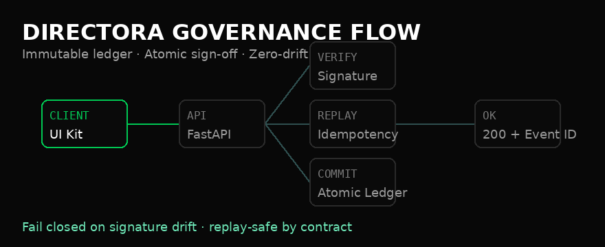
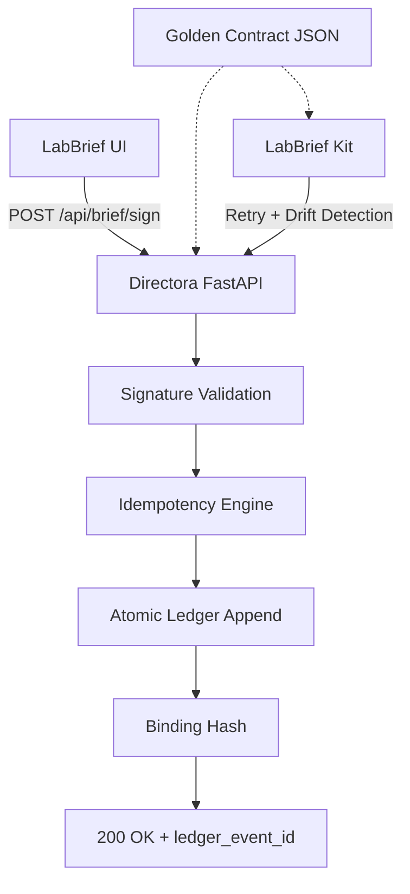

<!-- =======================
     DIRECTORA • README
     Production Governance Infrastructure
     ======================= -->

<div align="center">
  
</div>

<div align="center">

[](https://github.com/Scrutexity/Directora/actions/workflows/governance-proof.yml)
[](https://github.com/Scrutexity/Directora/stargazers)
[](https://github.com/Scrutexity/Directora/releases)
[](https://github.com/Scrutexity/Directora/blob/main/LICENSE)


# DIRECTORA

**Governance Infrastructure // Scrutexity**

*Immutable ledger. Atomic sign-off. Zero-drift contracts.*

[Architecture](#01--architecture) · [Repository Matrix](#02--repository-matrix) · [Deployment](#03--deployment--protocol) · [Contract](#04--contract-specification) · [Governance Proof](#05--governance-proof) · [Security](#06--compliance--security)

</div>

<div align="center">
  
</div>

---

## 01 // Architecture

Modern clinical operations fail from **system drift**.

Directora eliminates that failure mode by enforcing a provably correct, immutable, and retry-safe event ledger. If a transaction passes Directora governance, the client and server remain synchronized by contract.

> **Directora is an immutable governed commit system.**  
> The ledger append is the commit point. The contract is the boundary. Drift fails closed.

### Core Guarantees

| Guarantee | Enforcement | Outcome |
|---|---|---|
| **Atomicity** | Ledger append is the single isolated commit point | No partial states |
| **Idempotency** | Byte-identical replay detection | Safe retries without duplication |
| **Contract Integrity** | Golden contract alignment | Zero silent drift |
| **Auditability** | Immutable event history | Provable operational trail |
| **Governed Failure** | Fail-closed on signature or drift anomalies | Defense-in-depth |

> **Note:** Directora uses PHI-minimizing references such as `patient_ref` and `encounter_ref`. Raw clinical payloads are prohibited from the ledger.

---

## 02 // Repository Matrix

| Path | Stack | Function |
|---|---|---|
| `directora/` | FastAPI / Python | Governed server for append-only events, signing, and idempotency |
| `labbrief_kit/` | TypeScript | Public integration surface and retry-safe client logic |
| `shared/` | JSON Schema | Canonical contract source for client/server alignment |
| `tests/governance/` | Shell / Python CI gates | Automated drift gates and ledger discipline proofs |
| `docs/` | Markdown / Mermaid | Architecture notes and diagram source |
| `components/` | React / Framer Motion | Optional animated governance-flow component |

---

## 03 // Deployment & Protocol

### Initialization

```bash
python -m venv .venv
source .venv/bin/activate
pip install -r requirements-lock.txt

uvicorn directora.api.server:app --host 0.0.0.0 --port 8000 --reload
```

### Dependency lock (required for deploys)

Directora deploys are pinned and reproducible. Install from `requirements-lock.txt` (generated from `requirements.txt`).

To regenerate the lock:

```bash
pip install pip-tools
pip-compile requirements.txt -o requirements-lock.txt
```


### Health Check

```bash
curl http://localhost:8000/health
```

### Governance Verification

Directora is designed to be provably governed. The CI gate enforces canonical contract alignment, idempotent replays, and silent-drift prevention before merge.

```bash
./tests/governance/ultimate-governance-check.sh
```

Expected return:

```text
✅ GOVERNANCE ARCHITECTURE INTACT
   Directora and LabBrief cannot drift.
```

---

## 04 // Contract Specification

### Signing Protocol

```http
POST /api/brief/sign
```

| Header / Field | Requirement | Vector |
|---|---:|---|
| `Idempotency-Key` | Required | Safe identical replays without double-commits |
| `Signature` | Required | Authenticity verification and tamper prevention |
| `X-Contract-Version` | Required | Drift detection against the golden JSON schema |
| `X-Idempotency-Replayed` | Server return | Indicates replayed request returned identical response |
| `ledger_event_id` | Server return | Immutable event reference after commit |

### Commit Boundary



---

## 05 // Governance Proof

Directora’s governance model is not decorative. It is enforced.

The proof gate checks:

- Golden contract remains canonical.
- Client SDK and server behavior stay aligned.
- Replayed requests return byte-identical responses.
- Ledger append remains the commit boundary.
- Drift fails CI before merge.
- Unsafe failure paths block instead of silently degrading.

```bash
./tests/governance/ultimate-governance-check.sh
```

---

## 06 // Compliance & Security

Directora enforces strict access and data parameters:

| Control | Standard |
|---|---|
| **Zero PHI Bloat** | Only minimized references are logged |
| **Zero Secret Logging** | Signatures, tokens, and sensitive payloads are stripped from logs |
| **Least Privilege** | Runtime credentials operate with minimum viable access |
| **Fail-Closed Governance** | Signature or contract deviations block the operation |
| **Private Disclosure** | Security issues are handled privately before public discussion |

See [`SECURITY.md`](SECURITY.md) for disclosure protocols and [`CONTRIBUTING.md`](CONTRIBUTING.md) for pull-request governance.

> Directora does not claim HIPAA, SOC 2, FDA, legal, or regulatory certification. It provides governance mechanisms, auditability patterns, and safer workflow infrastructure.

---

## Enterprise Signals

- **Used internally at Scrutexity** as governance infrastructure for clinical-adjacent workflow proof.
- **Zero-drift contracts** keep client and server behavior aligned.
- **Immutable ledger references** create operational traceability without storing raw clinical content.
- **Retry-safe design** prevents accidental duplicate sign-off commits.
- **Fail-closed posture** treats unsafe drift as a blocked operation, not a warning.

---

## React Animation Component

The optional source component for the animated governance flow lives at:

```text
components/ScrutexityFlow.tsx
```

Install the dependency before using it:

```bash
npm install framer-motion
```

The component should remain `.tsx` because it contains React/SVG JSX.

---

## Star History

[](https://star-history.com/#Scrutexity/Directora&Date)

---

<div align="center">

**SCRUTEXITY // 2026**

*Built with precision. Governed by proof.*

</div>
