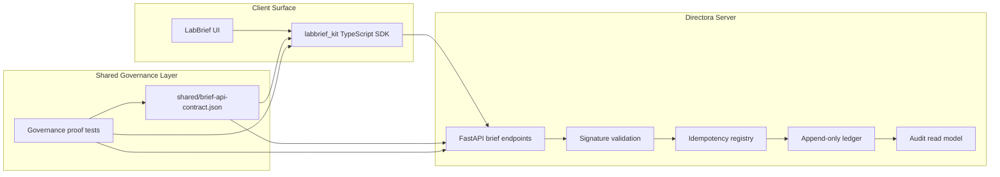

# Directora Architecture

Directora is a governed commit system for clinical-adjacent sign-off workflows. Its job is to make the sign-off moment atomic, replay-safe, and contract-bound.

## System Overview

## Commit Path

1. Client creates a sign-off payload.
2. Client sends `Idempotency-Key`, `Signature`, and `X-Contract-Version`.
3. Server validates signature and contract version.
4. Server checks idempotency.
5. Server appends to the ledger atomically.
6. Server returns `ledger_event_id`.
7. Byte-identical replay returns the same response.

## Governance Invariants

| Invariant | Requirement |
|---|---|
| Atomicity | Ledger append is the commit point |
| Idempotency | Duplicate retries must not create duplicate commits |
| Contract integrity | Client and server must align to the golden contract |
| Auditability | Ledger events must be append-only and traceable |
| PHI minimization | Ledger should use references, not raw clinical data |

## Diagram Source

The standalone Mermaid source is in [`directora-architecture.mmd`](directora-architecture.mmd).
